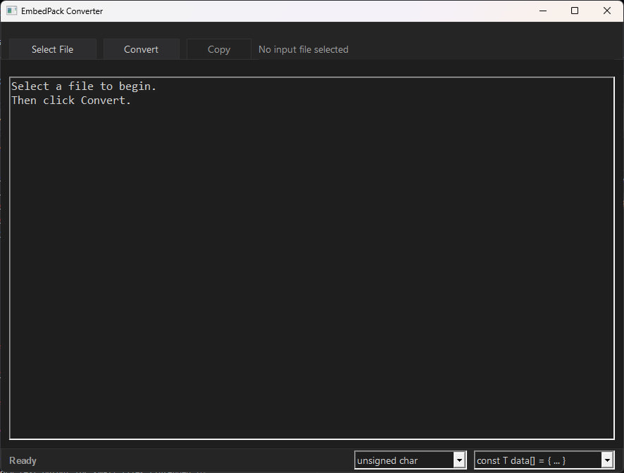

# EmbedPack — README

Version: 2.0.0  
Last updated: 2026-02-09

EmbedPack is a Win32 desktop utility that converts arbitrary files into C/C++ byte array initializers with support for large-file streaming and asynchronous execution.

## Screenshot

## Scope

This repository contains a Windows (Win32) GUI utility that converts an input file into a C/C++ byte array initializer.

Primary outputs:
- In-memory text output for small files (intended for UI display / clipboard copy).
- File output for large files (writes a `.cpp`-compatible text file with the generated byte array).
- Configurable element types and array styles (e.g., `unsigned char`, `uint8_t`, `std::byte`, `uint32_t`, `uint64_t`, and `std::array`/`constexpr` variants).

Target environment:
- Windows desktop (Win32 API).
- CMake-based build (MSVC toolchain expected).

## Architecture

### High-level components

- `EmbedPack::App`
  - Win32 application entry and message loop.
  - Owns the main window and UI state.
  - Initiates conversion jobs, owns format selections (element type + array style), and receives progress/completion notifications.

- `EmbedPack::CoreServices`
  - Clipboard helper for Unicode text.
  - File dialog helpers (open input file, save output path).
  - Converter subsystem with asynchronous execution.

### Data flow

1. User selects an input file through an Open File dialog.
2. The user chooses the desired output element type and array style from the bottom status bar dropdowns.
3. The application chooses a mode:
   - Small mode: generate output as a Unicode string in memory (intended for UI/clipboard).
   - Large mode: stream output into an on-disk file to avoid holding large text in memory.
4. Conversion runs on a worker thread.
5. The worker thread reports progress and completion back to the UI via window messages.

### Concurrency and notifications

The converter runs asynchronously using a dedicated worker thread. UI updates are triggered by posting window messages:
- `WM_APP_PROGRESS`: periodic progress updates (percentage).
- `WM_APP_DONE`: completion notification with a success flag and a result message.

## Operational Boundaries and Failure Modes

This section describes operational risks and misuse cases relevant to correctness and reliability. It does not claim security hardening beyond the stated behavior.

### In-scope scenarios

- User provides valid local file paths accessible for read (input) and write (output).
- Files can be empty or arbitrary binary content.
- Output is consumed as source text in C/C++ projects.

### Out-of-scope scenarios

- Files exceeding what the current process can map or address (e.g., exceeding `size_t` limits).
- Network shares or special filesystem semantics that prevent file mapping or stable reads.
- Guaranteeing that generated output compiles under every compiler configuration or style guide (format is a conventional `const unsigned char[]` initializer plus a `size_t` length).

### Failure modes handled

- Input file cannot be opened (permissions, missing file, locked file).
- File mapping fails (system limitations, access restrictions).
- Output file cannot be created or written (permissions, invalid path).
- Large files are blocked from the in-memory UI path by a soft size limit.

### Residual risks

- Very large conversions can take significant time and generate very large text outputs; large mode mitigates memory growth but output size still scales with input size.
- Conversion performance depends on disk throughput and OS file mapping behavior.
- If the application is terminated during large-mode conversion, the output file may be incomplete.

## Mechanisms / Implementation

### Conversion format

Output is C/C++ compatible source text whose element type and container style are user-selectable:

- Element types: `unsigned char`, `uint8_t`, `std::byte`, `unsigned short`, `uint16_t`, `uint32_t`, `uint64_t`.
- Array styles:
  - `const T data[] = { ... };`
  - `static const T data[] = { ... };`
  - `constexpr T data[] = { ... };`
  - `constexpr std::array<T, N> data = { ... };`
  - `static constexpr std::array<T, N> data = { ... };`

Formatting details:
- Bytes are grouped little-endian into the chosen element width (1/2/4/8 bytes). Partial trailing elements are padded with zeros to the nearest element boundary; the original byte length is emitted as `size_t fileBytesOriginalSize` when padding occurs.
- Hex tokens use the minimal necessary width for the chosen element size (at least two hex digits).
- Includes are emitted automatically (`<cstddef>`, `<cstdint>`, `<array>` as needed).
- A `size_t fileBytesSize = sizeof(fileBytes);` companion constant is always emitted.

Small mode generates the same logical content as a Unicode string in memory (intended for UI/clipboard). Large mode streams the identical format to disk.

### Size handling

- The converter exposes `UI_SOFT_LIMIT = 8 MiB` as the soft threshold for UI (in-memory) generation.
- Files above the UI soft limit are intended to be processed using large mode (file output) to avoid excessive UI memory use.
- For element widths greater than 1 byte, the last element may be zero-padded; use `fileBytesOriginalSize` to recover the original byte length.

### I/O strategy

- Input file is opened read-only and mapped into memory via file mapping for efficient access.
- Large-mode output is written incrementally to the output file using an internal buffered approach to avoid holding the entire generated text in memory.
- Progress is reported periodically during large-mode conversion.

## Limitations

### Known limitations

- Windows-only (Win32 API usage).
- Depends on file mapping; environments where mapping is restricted may fail conversions.
- Generated output is plain text and can become very large relative to the input size.
- Padding for multi-byte element types can introduce extra zeros at the end of `fileBytes`; consumers that require the exact original length should read `fileBytesOriginalSize`.

### Out-of-scope attacks / scenarios

- Not designed to defend against malicious local interference (e.g., external process tampering, forced termination, filesystem race conditions).
- Not designed for sandboxed or restricted runtime environments where clipboard or file dialogs are blocked.

### Residual risks

- Large output files can consume significant disk space.
- UI responsiveness depends on message handling and frequency of progress updates; conversion itself runs off the UI thread.

## Performance impact

Performance characteristics depend on:
- Input file size.
- Storage speed (read for input, write for output).
- CPU cost of formatting bytes into hex text.

Large mode is designed to reduce peak memory usage by streaming output rather than building a full in-memory string. Small mode generates a full in-memory Unicode string and is limited by the UI soft limit.

## Build and run

### Prerequisites

- Windows 10/11
- CMake (3.20+ recommended)
- MSVC toolchain (Visual Studio Build Tools or Visual Studio)

### Build with CMake (example)

1. Configure:
   - `cmake -S . -B build -G "Visual Studio 17 2022" -A x64`
2. Build:
   - `cmake --build build --config Release`

### Batch build script

- `build_release.bat` provides a Windows batch entry point for a Release build (see the script for details).

## Project structure

- `CMakeLists.txt`  
  CMake build configuration.

- `build_release.bat`  
  Convenience script for building a Release configuration on Windows.

- `main.cpp`  
  `wWinMain` entry point and application start.

- `App.h`  
  `EmbedPack::App` declaration (Win32 application wrapper).

- `App.cpp`  
  Win32 UI implementation, message loop integration, and job orchestration.

- `CoreServices.h`  
  Public APIs for clipboard, file dialogs, and conversion job interface.

- `CoreServices.cpp`  
  Implementations of clipboard, file dialogs, file sizing, and conversion logic (small in-memory path and large streaming path).

## Change Log

### 2.0.0 — 2026-02-09
- Added UI dropdowns to choose output element type (`unsigned char`, `uint8_t`, `std::byte`, `unsigned short`, `uint16_t`, `uint32_t`, `uint64_t`).
- Added array style presets (`const`, `static const`, `constexpr`, `constexpr std::array`, `static constexpr std::array`).
- Converter now emits required headers automatically and reports `fileBytesOriginalSize` when padding is applied for wider element types.
- Status bar height adjusted to accommodate format selectors.

### 1.0.0 — 2026-02-09
- Initial documented version.
- Win32 UI wrapper (`EmbedPack::App`) with asynchronous conversion jobs.
- Converter supports small (in-memory) and large (stream-to-file) output paths with progress reporting.
